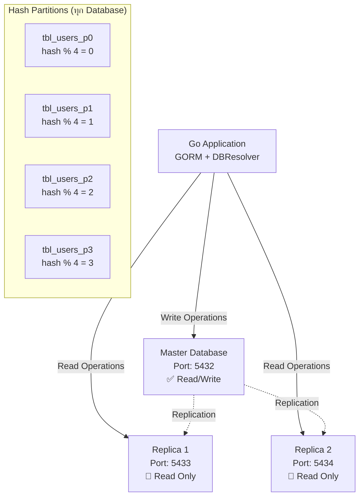

# PostgreSQL Sharding with Master-Replica Setup in Go

โครงการนี้เป็นตัวอย่างการทำ Database Sharding ด้วย PostgreSQL โดยใช้ Hash Partitioning และการตั้งค่า Master-Replica configuration พร้อมแอพพลิเคชัน Go ที่ใช้ GORM

## 🏗️ สถาปัตยกรรมระบบ



### การทำงานของระบบ

| Component     | Port | หน้าที่      | การเชื่อมต่อ                             |
| ------------- | ---- | ------------ | ---------------------------------------- |
| **Master DB** | 5432 | Write + Read | Go App → Master (INSERT, UPDATE, DELETE) |
| **Replica 1** | 5433 | Read Only    | Go App → Replica 1 (SELECT)              |
| **Replica 2** | 5434 | Read Only    | Go App → Replica 2 (SELECT)              |

## 📋 รายละเอียดไฟล์

### 1. `docker-compose.yml` - การจัดการ Container

**Master Database (lines 4-28):**

```yaml
master-db:
  image: postgres:17
  ports: - 5432:5432
  environment:
    POSTGRES_PASSWORD: postgres
    POSTGRES_USER: postgres
    POSTGRES_DB: postgres
```

**การตั้งค่า Volume Mount (lines 12-17):**

- `./init-master.sql` → สร้างตาราง partitions และ replication user
- `./pg_hba.conf` → การตั้งค่าสิทธิ์การเชื่อมต่อ
- `./postgresql.conf` → การตั้งค่า replication
- `./setup-config.sh` → script สำหรับนำ config files ไปใช้

**Health Check (lines 20-28):**

```bash
# ตรวจสอบว่า PostgreSQL พร้อมและมี 4 partitions ถูกสร้างแล้ว
pg_isready -U postgres && psql -U postgres -c "SELECT count(*) FROM pg_tables WHERE tablename LIKE 'tbl_users_p%';" | grep -q '4'
```

**Replica Databases (lines 30-130):**

- **Replica-One**: Port 5433
- **Replica-Two**: Port 5434

**การตั้งค่า Replica (lines 45-72, 96-123):**

```bash
# รอให้ master สร้าง partitions เสร็จ
until PGPASSWORD=postgres psql -h master-db -U postgres -c "SELECT count(*) FROM pg_tables WHERE tablename LIKE 'tbl_users_p%';" | grep -q '4'

# ทำ pg_basebackup จาก master
PGPASSWORD=replicator_password pg_basebackup -h master-db -D /var/lib/postgresql/data -U replicator -v -P

# ตั้งค่า replication สำหรับ PostgreSQL 17
echo "primary_conninfo = 'host=master-db port=5432 user=replicator password=replicator_password'" >> /var/lib/postgresql/data/postgresql.auto.conf
echo "hot_standby = on" >> /var/lib/postgresql/data/postgresql.auto.conf

# สร้าง standby.signal file (แทน standby_mode = on ใน version เก่า)
touch /var/lib/postgresql/data/standby.signal
```

### 2. `init-master.sql` - การตั้งค่าฐานข้อมูล Master

**Replication User (lines 1-5):**

```sql
-- สร้าง user สำหรับ replication
CREATE USER replicator REPLICATION LOGIN CONNECTION LIMIT 5 ENCRYPTED PASSWORD 'replicator_password';
GRANT CONNECT ON DATABASE postgres TO replicator;
```

**Hash Partitioning Setup (lines 9-26):**

```sql
-- สร้าง main table with hash partitioning
CREATE TABLE tbl_users (
    id UUID NOT NULL,
    first_name VARCHAR(255) NOT NULL,
    PRIMARY KEY (id)
) PARTITION BY HASH (id);

-- สร้าง 4 partitions โดยใช้ modulus 4
CREATE TABLE tbl_users_p0 PARTITION OF tbl_users FOR VALUES WITH (MODULUS 4, REMAINDER 0);
CREATE TABLE tbl_users_p1 PARTITION OF tbl_users FOR VALUES WITH (MODULUS 4, REMAINDER 1);
CREATE TABLE tbl_users_p2 PARTITION OF tbl_users FOR VALUES WITH (MODULUS 4, REMAINDER 2);
CREATE TABLE tbl_users_p3 PARTITION OF tbl_users FOR VALUES WITH (MODULUS 4, REMAINDER 3);
```

### 3. `postgresql.conf` - การตั้งค่า PostgreSQL

**Replication Settings (lines 1-6):**

```conf
wal_level = replica              # เปิดใช้ WAL สำหรับ replication
max_wal_senders = 5             # จำนวน sender processes สูงสุด
max_replication_slots = 5       # จำนวน replication slots สูงสุด
hot_standby = on                # อนุญาตให้ read จาก replica
listen_addresses = '*'          # รับ connection จากทุก IP
```

**Performance Settings (lines 8-10):**

```conf
max_connections = 100           # จำนวน connection สูงสุด
shared_buffers = 128MB         # memory สำหรับ shared buffers
```

**Logging Settings (lines 12-16):**

```conf
log_statement = 'all'          # log ทุก SQL statement
log_destination = 'stderr'     # ส่ง log ไป stderr
logging_collector = on         # เปิด log collector
log_filename = 'postgresql-%Y-%m-%d_%H%M%S.log'  # รูปแบบชื่อไฟล์ log
```

### 4. `pg_hba.conf` - การตั้งค่าสิทธิ์การเชื่อมต่อ

**Local Connections (lines 4-8):**

```conf
local   all             all                                     trust
host    all             all             127.0.0.1/32            md5
host    all             all             ::1/128                 md5
```

**Replication Connections (lines 11-13, 17, 21):**

```conf
local   replication     all                                     trust
host    replication     all             127.0.0.1/32            md5
host    replication     replicator      172.18.0.0/16           md5  # Docker network
host    replication     replicator      0.0.0.0/0               md5  # ทุก IP
```

**Docker Network Access (lines 16, 20):**

```conf
host    all             all             172.18.0.0/16           md5  # Docker internal network
host    all             all             0.0.0.0/0               md5  # External access
```

### 5. `setup-config.sh` - Script การตั้งค่า

**การคัดลอก Config Files (lines 7-8):**

```bash
cp /docker-entrypoint-initdb.d/02-pg_hba.conf /var/lib/postgresql/data/pg_hba.conf
cp /docker-entrypoint-initdb.d/03-postgresql.conf /var/lib/postgresql/data/postgresql.conf
```

**การตั้งค่าสิทธิ์ (lines 11-12):**

```bash
chown postgres:postgres /var/lib/postgresql/data/pg_hba.conf
chown postgres:postgres /var/lib/postgresql/data/postgresql.conf
```

**การโหลด Configuration ใหม่ (lines 17-19):**

```sql
SELECT pg_reload_conf();  -- โหลด config ใหม่โดยไม่ต้อง restart
```

### 6. `go.mod` & `go.sum` - Dependencies

**หลัก Dependencies (lines 5-11 ใน go.mod):**

```go
github.com/caarlos0/env/v11 v11.3.1     // Environment variable parsing
github.com/google/uuid v1.6.0          // UUID generation
gorm.io/driver/postgres v1.6.0         // PostgreSQL driver สำหรับ GORM
gorm.io/gorm v1.30.2                   // ORM framework
gorm.io/plugin/dbresolver v1.6.2       // Master-Replica resolver
```

### 7. `main.go` - แอพพลิเคชัน Go

**User Model (lines 14-29):**

```go
type User struct {
    ID        uuid.UUID `gorm:"column:id;type:uuid;primary_key"`
    FirstName string    `gorm:"column:first_name;type:varchar(255);not null"`
}

func (User) TableName() string {
    return "tbl_users"  // ชี้ไปที่ partitioned table
}

func (u *User) BeforeCreate(tx *gorm.DB) (err error) {
    u.ID, err = uuid.NewV7()  // สร้าง UUID v7 (time-ordered)
    return
}
```

**Environment Configuration (lines 31-53):**

```go
var ENV struct {
    MasterDB struct {
        DBName     string `env:"NAME" envDefault:"postgres"`
        DBHost     string `env:"HOST" envDefault:"localhost"`
        DBPort     string `env:"PORT" envDefault:"5432"`
        DBUser     string `env:"USER" envDefault:"postgres"`
        DBPassword string `env:"PASSWORD" envDefault:"postgres"`
    } `envPrefix:"MASTER_DB_"`

    ReplicaOne struct {
        // Port 5433
    } `envPrefix:"REPLICA_ONE_"`

    ReplicaTwo struct {
        // Port 5434
    } `envPrefix:"REPLICA_TWO_"`
}
```

**Database Connection Setup (lines 84-100):**

```go
func connectDB() *gorm.DB {
    // เชื่อมต่อ master database
    db, err := gorm.Open(postgres.Open(GetDSN(...)), &gorm.Config{})

    // ตั้งค่า DB Resolver สำหรับ master-replica
    db.Use(dbresolver.Register(dbresolver.Config{
        Sources: []gorm.Dialector{postgres.Open(masterDSN)},  // Master สำหรับ write
        Replicas: []gorm.Dialector{
            postgres.Open(replica1DSN),  // Replica 1 สำหรับ read
            postgres.Open(replica2DSN),  // Replica 2 สำหรับ read
        },
        Policy: dbresolver.RandomPolicy{},  // สุ่มเลือก replica สำหรับ read
    }))

    return db
}
```

**Data Insertion (lines 102-114):**

```go
func insertData(db *gorm.DB) {
    users := []User{
        {FirstName: "John"},    // จะถูก hash ไปที่ partition ใดซึ่ง partition หนึ่ง
        {FirstName: "Jane"},    // UUID จะถูก hash และกระจายไปตาม modulus 4
        {FirstName: "Bob"},
        {FirstName: "Alice"},
        {FirstName: "Charlie"},
    }

    db.Create(&users)  // GORM จะเขียนไปที่ master database
}
```

**Partition Query (lines 116-142):**

```go
func queryPartitions(db *gorm.DB) {
    partitions := []string{"tbl_users_p0", "tbl_users_p1", "tbl_users_p2", "tbl_users_p3"}

    for _, partition := range partitions {
        var count int64
        db.Table(partition).Count(&count)  // นับจำนวนในแต่ละ partition

        var users []User
        db.Table(partition).Find(&users)   // อ่านข้อมูลจาก replica (random)
        // แสดงผลการกระจายข้อมูลในแต่ละ partition
    }

    user := User{}
	if err := db.First(&user).Error; err != nil {
		log.Fatalf("error getting user: %v", err)
	}

	uuidTime := user.ID.Time()
	sec, nsec := uuidTime.UnixTime()
	createdTime := time.Unix(sec, nsec)
	fmt.Printf("User: %s (ID: %s, CreatedDate: %s)\n", user.FirstName, user.ID, createdTime.Format("2006-01-02 15:04:05")) // ดูวันที่สร้างข้อมูล
}
```

## 🚀 วิธีการรัน

### 1. เริ่มต้นระบบ

```bash
# สร้างและเริ่ม containers
docker-compose up -d

# ตรวจสอบสถานะ
docker-compose ps

# ดู logs
docker-compose logs -f master-db
docker-compose logs -f replica-one
docker-compose logs -f replica-two
```

### 2. รันแอพพลิเคชัน Go

```bash
# ติดตั้ง dependencies
go mod tidy

# รันโปรแกรม
go run main.go
```

### 3. ตรวจสอบการทำงาน

**เชื่อมต่อ Master Database:**

```bash
docker exec -it sharding-golang-master-db-1 psql -U postgres -d postgres
```

**เชื่อมต่อ Replica:**

```bash
# Replica 1
docker exec -it sharding-golang-replica-one-1 psql -U postgres -d postgres

# Replica 2
docker exec -it sharding-golang-replica-two-1 psql -U postgres -d postgres
```

**ตรวจสอบ Partitions:**

```sql
-- ดูจำนวนข้อมูลในแต่ละ partition
SELECT 'tbl_users_p0' as partition, count(*) FROM tbl_users_p0
UNION ALL
SELECT 'tbl_users_p1' as partition, count(*) FROM tbl_users_p1
UNION ALL
SELECT 'tbl_users_p2' as partition, count(*) FROM tbl_users_p2
UNION ALL
SELECT 'tbl_users_p3' as partition, count(*) FROM tbl_users_p3;

-- ดูข้อมูลใน partition ที่มีข้อมูล
SELECT * FROM tbl_users_p0;
SELECT * FROM tbl_users_p1;
SELECT * FROM tbl_users_p2;
SELECT * FROM tbl_users_p3;
```

**ตรวจสอบ Replication Status:**

```sql
-- ใน Master
SELECT * FROM pg_stat_replication;

-- ใน Replica
SELECT * FROM pg_stat_wal_receiver;
```

## 🔧 Environment Variables

สามารถตั้งค่า Environment Variables สำหรับแอพพลิเคชัน Go:

```bash
# Master Database
export MASTER_DB_HOST=localhost
export MASTER_DB_PORT=5432
export MASTER_DB_USER=postgres
export MASTER_DB_PASSWORD=postgres
export MASTER_DB_NAME=postgres

# Replica 1
export REPLICA_ONE_HOST=localhost
export REPLICA_ONE_PORT=5433
export REPLICA_ONE_USER=postgres
export REPLICA_ONE_PASSWORD=postgres
export REPLICA_ONE_NAME=postgres

# Replica 2
export REPLICA_TWO_HOST=localhost
export REPLICA_TWO_PORT=5434
export REPLICA_TWO_USER=postgres
export REPLICA_TWO_PASSWORD=postgres
export REPLICA_TWO_NAME=postgres
```

## 📊 การทำงานของ Hash Partitioning

PostgreSQL จะใช้ hash function กับ UUID และทำ modulus 4 เพื่อกำหนดว่าข้อมูลจะไปอยู่ partition ไหน:

hash(uuid) % 4 = 0 → tbl_users_p0
hash(uuid) % 4 = 1 → tbl_users_p1
hash(uuid) % 4 = 2 → tbl_users_p2
hash(uuid) % 4 = 3 → tbl_users_p3

## ⚡ ข้อดีของสถาปัตยกรรมนี้

1. **Load Distribution**: ข้อมูลกระจายอย่างสม่ำเสมอใน 4 partitions
2. **Read Scalability**: อ่านข้อมูลจาก 2 replicas ลดโหลดจาก master
3. **High Availability**: ถ้า replica ตัวหนึ่งล้ม ยังอ่านจากอีกตัวได้
4. **Automatic Failover**: GORM DB Resolver จะจัดการการเลือก replica อัตโนมัติ

## 🛠️ การหยุดระบบ

```bash
# หยุด containers
docker-compose down

# หยุดและลบ volumes (ข้อมูลจะหายหมด)
docker-compose down -v

# หยุดและลบ images
docker-compose down --rmi all
```

## 📝 หมายเหตุ

- ใช้ PostgreSQL 17 ซึ่งมีการเปลี่ยนแปลงการตั้งค่า replication จาก version เก่า
- UUID v7 ให้การกระจายที่ดีกว่า UUID v4 เพราะมี time component
- DBResolver Policy สามารถเปลี่ยนเป็น `RoundRobinPolicy` หรือ custom policy ได้
- Health checks ใน docker-compose ช่วยให้แน่ใจว่า replicas เริ่มหลังจาก master พร้อมแล้ว
